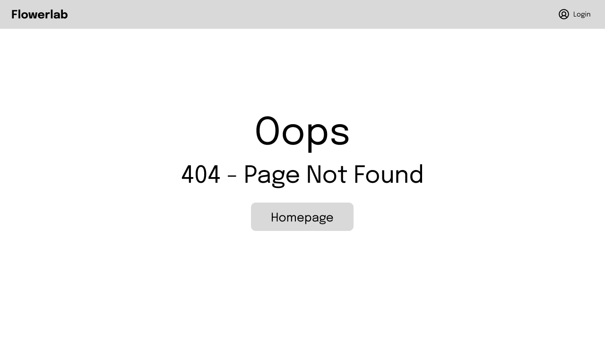

# 💻 FLOWERLAB
FLOWERLAB adalah sebuah website yang memuat konten menganai berbagai bunga dengan berbagai informasinya, terdapat fitur image recognition, dan tempat jual beli bunga

# 👨‍💻 Anggota kelompok
Ketua kelompok : 
Muhammad Arif Hidayat - 20/463609/TK/51601  

Anggota :
1. Faizah Bestiyana Darmawati - 20/456364/TK/50494
2. Putri Ayu Shintaningrum - 20/460559/TK/51148

# 📃 Daftar konten

<h2>🔽 Modul 1</h2>

## Latar Belakang
Anggrek merupakan salah satu tanaman hias yang banyak diminati dan dicari oleh penikmat tanam-tanaman khususunya anggrek. Oleh karena itu, saat ini bisnis penjualan anggrek adalah bisnis yang menjanjikan dan memiliki pasar yang jelas. Namun, anggrek memiliki berbagai jenis yang tiap jenisnya memiliki nilai yang berbeda. 

## Rumusan Permasalahan
Masih banyak peminat anggrek yang belum mengetahui jenis-jenis anggrek.  
Tempat jual beli khusus anggrek masih terbatas. 

## Ide solusi
Membuat web app yang terintegrasi AI. 

## Rencana Fitur-Fitur

## Analisis Kompetitor

<h2>🔽 Modul 2</h2>

## Tujuan dari produk
Tujuannya adalah untuk para peminat bunga anggrek yang masih kebingungan dalam membedakan tiap jenis bunga anggrek, mereka dapat memanfaatkan fitur image recognition untuk mengetahui jenis anggrek yang mereka inginkan. Selain itu ada platform untuk mempertemukan antara penjual dan pembeli bunga anggrek (transaksi dilakukan di luar web).

## Pengguna Potensial dan Kebutuhan Para Pengguna
- Peminat Bunga Anggrek : informasi terkait setiap jenis bunga anggrek
- Penjual Bunga Anggrek : platform penjualan bunga anggrek
- Pembeli Bunga Anggrek : platform pembelian bunga anggrek

## Use case

## Functional Requirements

## ERD

## Lo-Fi Design

### Page Landing Page

### Page Flowerlab Marketplace

### Page Sign Up/Register

### Page Login

### Page Profile Penjual

### Page Menambah Produk Bunga

### Page Deskripsi Bunga

### Page 404 not found

## Gantt Chart

<h2>🔽 PR Modul 3</h2>

## Rangkuman

## Issue yang Dikerjakan
### Mencari Color Palette

### Mencari Desain Web

### Mengumpulkan Dataset AI

### Membuat Hi-Fi Wireframe

[[Issue yang dikerjakan selengkapnya]](https://docs.google.com/document/d/147SH6SlzbMyHlm8dcoOZ1TwMgDPipiZ8/edit?usp=sharing&ouid=101317987323399690576&rtpof=true&sd=true)

## Peran Anggota

